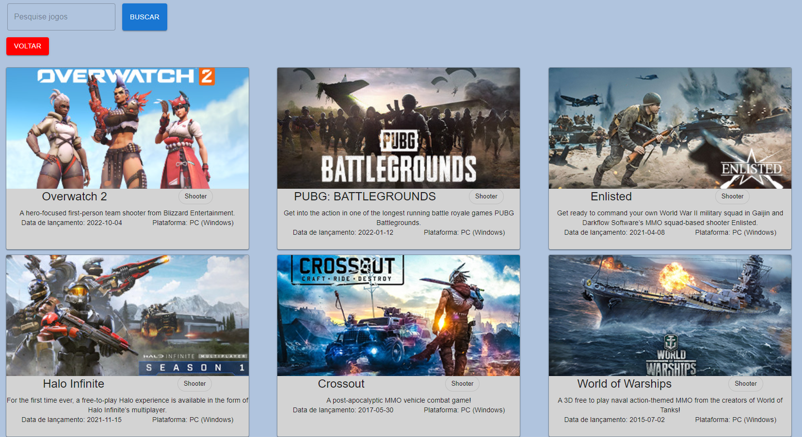
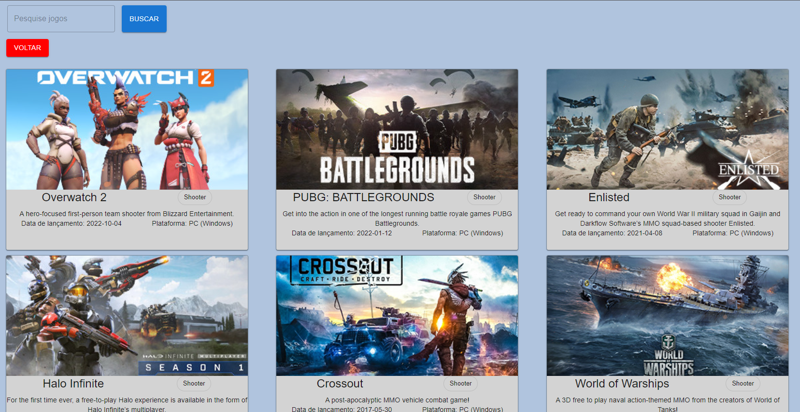

# Projeto Games-appmasters
 
# Descrição:
O propósito do projeto, é de consumir a API da app-masters e criar uma lista com os jogos, permitindo-o filtragem dos jogos por gênero ou buscar um jogo específico pelo nome.

# Link para visualizar projeto on-line:
https://games-appmasters.vercel.app/

# Funcionalidades
- O projeto deve ser feito usando React ou Next.JS (ok)
- Obter a lista de jogos em `/data` (ok)
- Apresentar um loader enquanto os dados são obtidos (ok)
- Apresentar os jogos em três colunas (no computador) (ok)
- Em cada card apresentar o título e imagem pelo ao menos (ok)
- Lidar com a responsividade, para que fique bem apresentado no computador, tablets ou celular (ok)
- Quando a API retornar o `status code` 500, 502, 503, 504, 507, 508 ou 509 apresentar ao usuário `O servidor fahou em responder, tente recarregar a página` (ok)
- Caso a API retorne outros erros, apresentar `O servidor não conseguirá responder por agora, tente voltar novamente mais tarde` (ok)
- Ao realizar uma chamada, não esperar mais que 5 segundos pelo retorno. Se os dados demorarem mais de 5 segundos para retornar apresentar `O servidor demorou para responder, tente mais tarde` (ok)
- Sempre que apresentar uma mensagem para o usuário, ou tiver os dados em mãos para apresentar, ocultar o loader (ok)
- Incluir um campo de busca, que permite localizar jogos pelo título, com busca case insensitive (O filtro funciona, porém, case sensitive)
- Uma vez que tenha os dados em mãos, veja quais `genre` foram retornados e permita ao usuário selecionar um deles, e então filtre para exibir apenas jogos do gênero selecionado (ok)
(Para filtrar, basta clicar no chip com o nome do gênero que deseja, e a filtragem será realizada)

# Fotos do projeto

